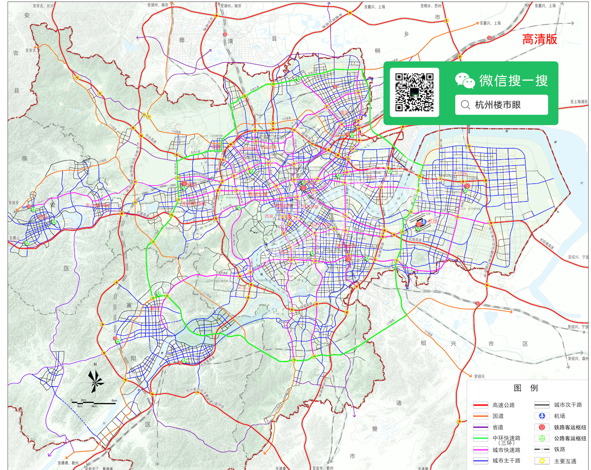
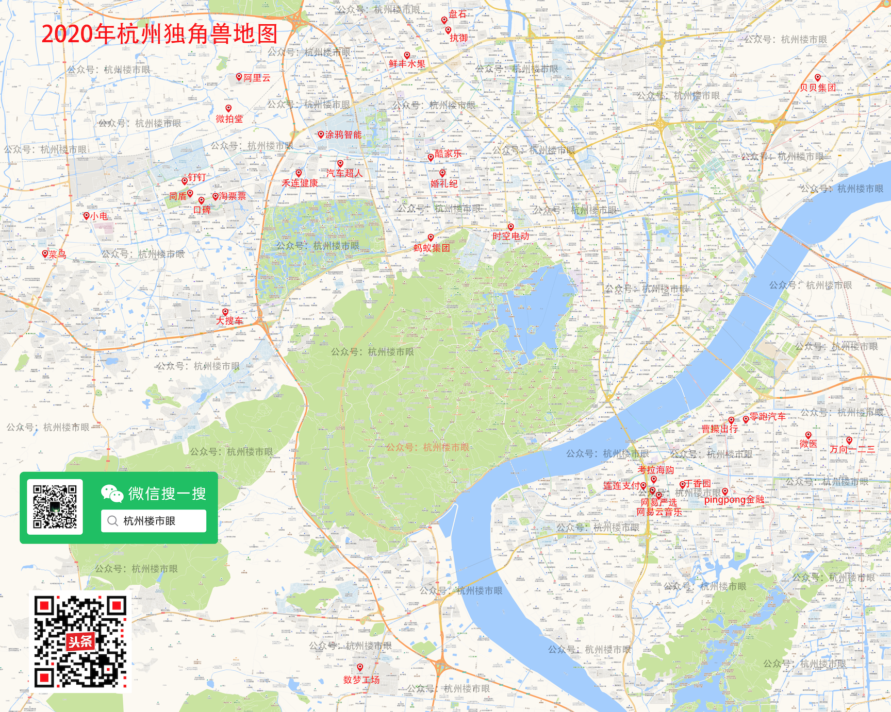
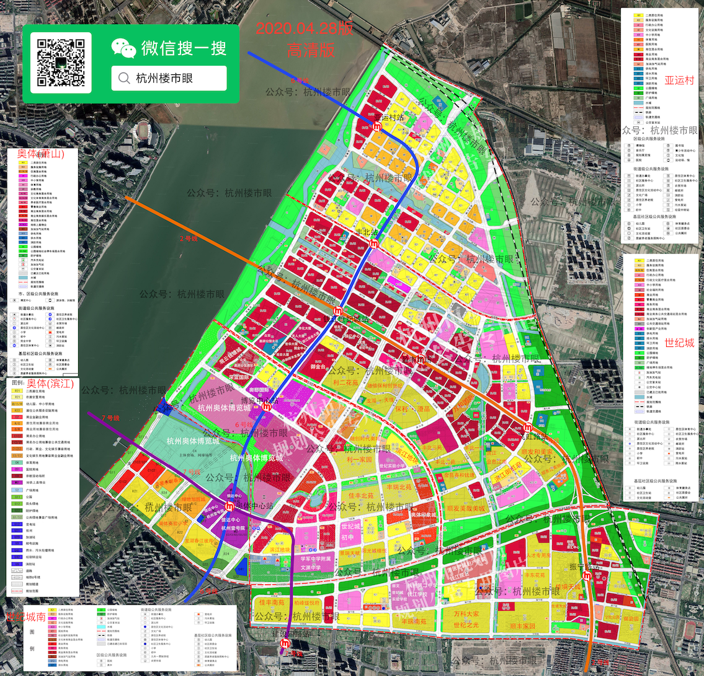

# 杭州楼市眼
主要制作杭州市各板块规划图、地铁图、产业布局图等，专注于从规划提前分析板块前景。

>关注公众号:杭州楼市眼，输入对应的板块名称，即可返回高清规划图。
>如果不知道有哪些关键词，可以输入：**规划图**

* 

## 杭州各板块规划图导航
[https://mp.weixin.qq.com/s/7TJtx_TrMXSUgJjkslBR4A
](https://mp.weixin.qq.com/s/7TJtx_TrMXSUgJjkslBR4A)

## 买房技术
[https://mp.weixin.qq.com/s/1buFCOOIBpXtIRLjiSKV0Q](https://mp.weixin.qq.com/s/1buFCOOIBpXtIRLjiSKV0Q)

## 规划图示例
* 杭州地铁三期
小图.png)
* 杭州道路规划

* 2020杭州独角兽地图

* 奥体、世纪城、亚运村规划图

## 说明

> 此git不定期更新，最新规划图见微信公众号或头条号：杭州楼市眼
